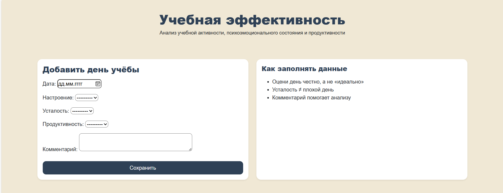
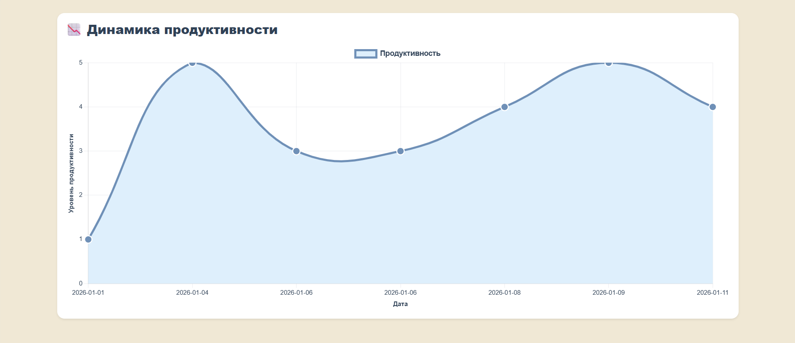
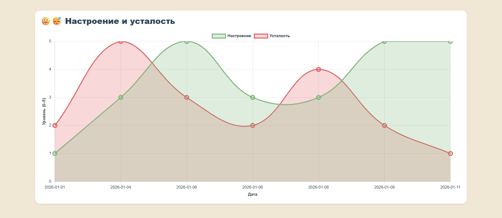
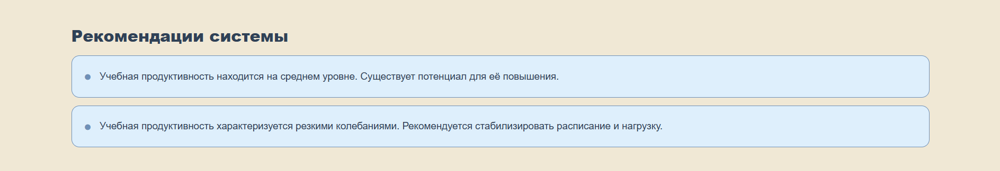
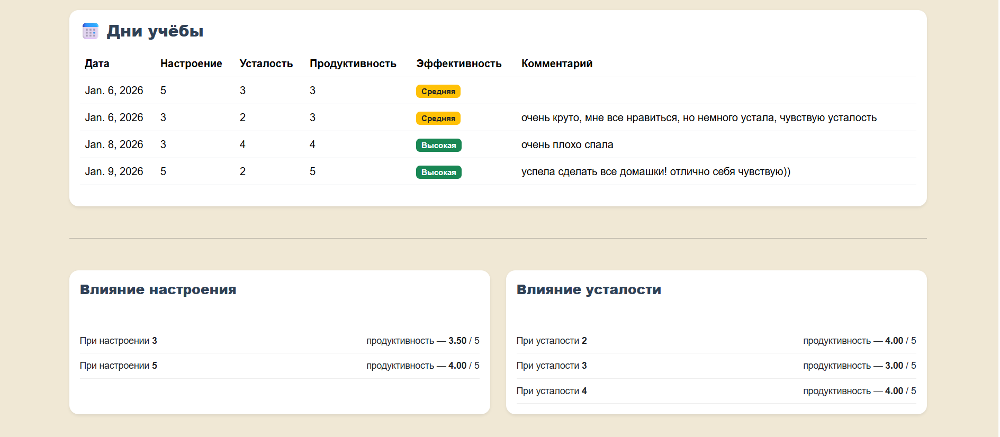

# 📊 Учебная эффективность
Веб-сервис для мониторинга и анализа учебной активности обучающегося
на основе психоэмоциональных показателей и уровня продуктивности.

Сервис позволяет фиксировать учебные дни, анализировать динамику
продуктивности, визуализировать данные и получать рекомендации
по улучшению учебного процесса.

## ⚙️ Функциональные возможности
- добавление учебных дней (дата, настроение, усталость, продуктивность, комментарий);
- хранение данных в базе данных;
- фильтрация данных по выбранному периоду;
- расчёт средних показателей учебной активности;
- визуализация данных с помощью графиков;
- анализ влияния настроения и усталости на продуктивность;
- классификация учебных дней по уровню эффективности;
- формирование текстовых рекомендаций.

## 🛠 Используемые технологии

- Python 3
- Django
- SQLite
- HTML / CSS
- Bootstrap
- Chart.js

## Установка и запуск
```bash
pip install -r requirements.txt
python manage.py migrate
python manage.py runserver
```

## Интерфейс системы
### Главная страница


### Визуализация данных




### Рекомендации


### Таблица учебных дней 
